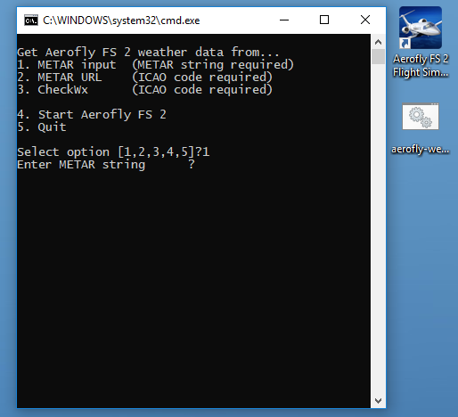

 AeroWX - METAR weather importer for Aerofly FS 2
==================================================

Copy [METAR weather information](docs/metar.md) into [IPCAS' Aerofly FS 2](https://www.aerofly.com/).

The AeroWX command line tools will copy the following METAR weather information to your configuration file while Aerofly FS 2 is _not_ running:

* Time and day (will set the year and month to current year and month because they are not present in METAR information)
* Wind & turbulences
* Thermal activity
* Clouds (height & density)

The [METAR weather information](docs/metar.md) can be supplied manually, or can be fetched from an URL.

AeroWX is capable of setting weather values which you cannot access in Aerofly FS 2. This is tested and is done deliberately. Please supply [feedback](https://github.com/fboes/aerofly-weather/issues) in case of any strange effects you encounter.

Installation
------------

1. This tool requires Windows, Mac OSX or Linux.
1. Install [Node.js](https://nodejs.org/) with at least version 10.
1. Open the Command Prompt / Terminal application already installed on your computer.
1. Type `npm install -g aerofly-weather` and hit `ENTER` to install Aerofly-Weather (AeroWX).
1. Type `aerowx-make-batch` and hit `ENTER` to create the main batch file on your desktop.

This package also comes with a load of [command line tools](docs/command-line.md). For basic usage the desktop batch file will suffice.

Usage of desktop batch file
---------------------------

You will need a copy of IPACS' Aerofly FS 2 which has run at least once. This creates a file called `main.mcf`, which contains all settings and the weather data in Aerofly FS 2. This file will be modified by the tools supplied with this package.

Click on the desktop file called `aerowx-weather.bat` / `aerowx-weather.sh` and follow the on-screen instructions. Basically it offers you to:

* Set weather data from a [METAR weather string](docs/metar.md).
* Fetch weather data from the [AVWX API](https://avwx.rest/) and set the weather accordingly.
* Fetch weather data from the [CheckWX API](https://www.checkwx.com/) (API key required) and set the weather accordingly.

Whenever you are asked for an ICAO code, you may supply `DEP` / `ARR` to get your last Aerofly FS 2 flightplan departure / arrival airport.

The desktop batch file also contains some settings for the tools. If you want to edit the desktop batch file, just right click on it and select "Edit". There is a small [guide on how to work with the command line tools contained in the desktop batch file](docs/command-line.md).

Advanced usage
--------------

This package comes with a load of [command line tools](docs/command-line.md). These can be integrated into scripts or batch files.

Update
------

1. To find out if your installation of Aerofly-Weather needs updating, run `npm outdated -g aerofly-weather`.
2. Run `npm update -g aerofly-weather` to update your local Aerofly-Weather installation to the latest stable release.
3. Optional: Use `aerowx-make-batch` to create a new batch file on your desktop.

Status
-------

Legal stuff
-----------

Author: [Frank Boës](http://3960.org)

Copyright & license: See [LICENSE.txt](LICENSE.txt)

This tool is NOT affiliated with, endorsed, or sponsored by IPACS GbR. As stated in the [LICENSE.txt](LICENSE.txt), this tool comes with no warranty and might damage your files.

This software complies with the General Data Protection Regulation (GDPR) as it does not collect nor transmits any personal data but for data your submit by using the CLI commands using URLs. For GDPR compliance of these services refer to the legal statements of these services.
