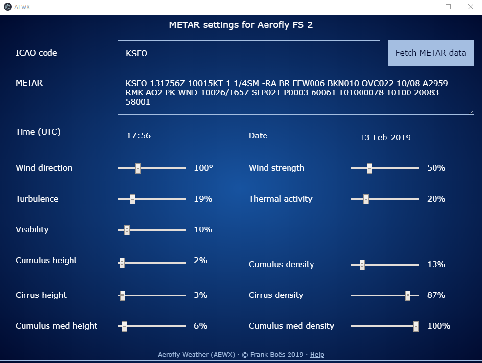

 AeroWX - METAR weather importer for Aerofly FS 2
==================================================

Copy [METAR weather information](docs/metar.md) into [IPCAS' Aerofly FS 2](https://www.aerofly.com/).

The AeroWX tools will copy the following METAR weather information to your configuration file while Aerofly FS 2 is _not_ running:

* Time and day (will set the year and month to current year and month because they are not present in METAR information)
* Wind & turbulences
* Thermal activity
* Clouds (height & density)

The [METAR weather information](docs/metar.md) can be supplied manually, or can be fetched from an URL.

AeroWX is capable of setting weather values which you cannot access in Aerofly FS 2. This is tested and is done deliberately. Please supply [feedback](https://github.com/fboes/aerofly-weather/issues) in case of any strange effects you encounter.

Installation
------------

If you are interested in the legacy tools, there are [very different installation instructions for the legacy CLI tools](docs/command-line.md).

As of now there is only a compiled version for Windows 10.

1. Download the current release ZIP from https://github.com/fboes/aerofly-weather/releases.
2. Unpack the ZIP file to some sensible location.
3. Create a shortcut on your desktop by right-clicking `aerofly-weather.exe` > "Send to" > "Desktop (Create shortcut)".
3. Start the application by clicking on the desktop link.

Usage of the desktop app
------------------------

You will need a copy of IPACS' Aerofly FS 2 which has run at least once. This creates a file called `main.mcf`, which contains all settings and the weather data in Aerofly FS 2. This file will be modified by the app.

On start-up the app will load the current settings from your `main.mcf`.

By changing the settings in the app, these values will transferred to the `main.mcf` right away. It also allows for changing values which are not accessible from inside Aerofly FS 2.

By entering a METAR code you can see the settings for Aerofly FS 2 being adjusted automatically. These settings will be saved to the `main.mcf` in an instant.

By pressing the "Fetch" button the app tries to fetch METAR data from a remote internet service for the given ICAO code. If it is successful, it will paste the METAR code and convert it into the corresponding Aerofly FS 2 values.

Advanced usage
--------------

This package comes with a load of [command line tools](docs/command-line.md). These can be integrated into scripts or batch files.

Status
-------

Legal stuff
-----------

Author: [Frank Boës](http://3960.org)

Copyright & license: See [LICENSE.txt](LICENSE.txt)

This tool is NOT affiliated with, endorsed, or sponsored by IPACS GbR. As stated in the [LICENSE.txt](LICENSE.txt), this tool comes with no warranty and might damage your files.

This software complies with the General Data Protection Regulation (GDPR) as it does not collect nor transmits any personal data but for data your submit by using the CLI commands using URLs. For GDPR compliance of these services refer to the legal statements of these services.
